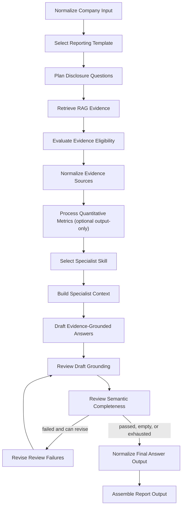

# ESG Report LangGraph

He thong agent tao bao cao ESG dinh tinh va dinh luong, xay tren LangGraph. Repo nay nhan thong tin cong ty, chon bo template theo quy mo va nganh, goi Team RAG de lay evidence dinh tinh, anh xa du lieu dinh luong, sau do tao output audit dang JSON va Excel.

## Muc Tieu

- Tao cau tra loi ESG dinh tinh theo 95 cau hoi trong `template_v1/question/questions.json`.
- Tuy bien guideline theo 4 quy mo cong ty va 11 nhom nganh.
- Bat buoc cau tra loi dua tren evidence tu RAG; neu evidence thieu, yeu, hoac khong khop thi `Final Answer` de trong.
- Anh xa 251 metric dinh luong `QUANT-0001..QUANT-0251` ma khong dung LLM.
- Luu vet audit: evidence summary, source metadata, QA notes, skill duoc chon, quality flags, revision count.

## Cau Truc Repo

```text
esgagents/
  api/app.py                 FastAPI entrypoint
  cli.py                     Typer CLI entrypoint
  default_config.py          Cau hinh mac dinh va bien moi truong
  graph/                     LangGraph workflow
  agents/                    Cac node xu ly intake, template, RAG, evidence, QA, report
  llm_clients/               OpenAI-compatible LLM client va offline fallback
  output_writer.py           Ghi JSON va Excel audit
  quantitative.py            Load, normalize va map du lieu dinh luong
  rag_client.py              Client goi Team RAG
  schemas.py                 Pydantic contracts
  template_loader.py         Load va validate template JSON
skills/
  *.md                       Skill instruction cho tung nhom ESG
  agents/                    Router, context builder, writer, critic
template_v1/
  question/questions.json    95 cau hoi ESG
  quantitative/              251 metric dinh luong
  scales/*.json              4 profile quy mo cong ty
  industries/*.json          11 profile nganh
tests_esg/                   Unit/offline tests
```

## Yeu Cau

- Python `>=3.10`
- Hoac Docker Desktop/Docker Engine co Docker Compose neu chay full stack bang container
- Team RAG service co endpoint `/qualitative/evidence/v3` (co the rollback thu cong ve v2)
- OpenAI hoac HallMDR API key neu muon dung LLM drafting that; khong co key thi co the chay che do fallback/offline cho mot so luong test va luong deterministic

## Cai Dat

```powershell
python -m venv .venv
.\.venv\Scripts\Activate.ps1
python -m pip install -U pip
python -m pip install -e .
```

Tao file `.env` tu file mau. Local CLI va Docker deu doc file nay; bien da co
trong process environment duoc uu tien hon gia tri trong file:

```powershell
Copy-Item .env.example .env
```

Neu chay truc tiep bang PowerShell, set bien moi truong trong session:

```powershell
$env:TEAM_RAG_BASE_URL="https://your-rag-service"
$env:TEAM_RAG_QUALITATIVE_PATH="/qualitative/evidence/v3"
$env:ESG_AGENT_MODE="auto"
$env:ESG_OUTPUT_LANGUAGE="Korean"
```

## Cau Hinh Chinh

| Bien moi truong                   |                                      Mac dinh | Y nghia                                                                                                 |
| --------------------------------- | --------------------------------------------: | ------------------------------------------------------------------------------------------------------- |
| `TEAM_RAG_BASE_URL`               |                                          rong | Base URL cua Team RAG. Bat buoc khi goi RAG live.                                                       |
| `TEAM_RAG_QUALITATIVE_PATH`       |                    `/qualitative/evidence/v3` | Endpoint qualitative. Dat `/qualitative/evidence/v2` de rollback; khong co fallback tu dong.            |
| `TEAM_RAG_REQUEST_CONTRACT`       |                                         `new` | `new` gui `question_ids`; dat `legacy` de rollback ve `item_ids + year`.                                |
| `TEAM_RAG_TIMEOUT_SECONDS`        |                                          `30` | Timeout moi request RAG.                                                                                |
| `TEAM_RAG_TOP_K`                  |                                           `5` | Voi metric la so block `primary`; voi cau khac la ngan sach evidence.                                   |
| `ESG_TEAM_RAG_RETRY_TOP_K`        |                                           `0` | Neu > `TEAM_RAG_TOP_K`, retry QID evidence rong/yeu voi top_k cao hon.                                  |
| `TEAM_RAG_BATCH_SIZE`             |                                          `20` | So QID trong moi batch RAG.                                                                             |
| `TEAM_RAG_CONCURRENCY`            |                                           `4` | So batch RAG chay song song.                                                                            |
| `ESG_TEMPLATE_DIR`                |                                 `template_v1` | Thu muc template cau hoi/quy mo/nganh.                                                                  |
| `ESG_OUTPUT_DIR`                  |                                `data/outputs` | Noi ghi output JSON va Excel.                                                                           |
| `ESG_CACHE_DIR`                   |                                  `data/cache` | Noi ghi checkpoint SQLite khi bat checkpoint.                                                           |
| `ESG_QUANTITATIVE_OUTPUT_ENABLED` |                                       `false` | Bat sheet/artifact dinh luong rieng. Khi `false`, workflow qualitative khong goi loader/API dinh luong. |
| `ESG_QUANTITATIVE_INPUT_MODE`     |                                        `file` | Nguon dinh luong output-only khi `ESG_QUANTITATIVE_OUTPUT_ENABLED=true`: `file` hoac `api`.             |
| `ESG_QUANTITATIVE_INPUT_DIR`      |                                 `data/inputs` | Thu muc input dinh luong theo cong ty/nam.                                                              |
| `ESG_QUANTITATIVE_API_BASE_URL`   |                                          rong | Base URL cho API dinh luong khi dung `api`.                                                             |
| `ESG_QUANTITATIVE_API_PATH`       | `/companies/{company_id}/{year}/quantitative` | GET path dinh luong.                                                                                    |
| `ESG_QUANTITATIVE_API_METHOD`     |                                         `GET` | `GET` legacy hoac `POST` cho RAG `/quantitative/answers`.                                               |
| `ESG_METRIC_QID_BRIDGE_ENABLED`   |                                       `false` | Deprecated. Cau qualitative Metrics dung contract metric cua RAG, khong bridge tu API dinh luong rieng. |
| `ESG_OUTPUT_TIMEZONE`             |                                `Asia/Bangkok` | Mui gio dung trong ten workbook tong hop.                                                               |
| `ESG_AGENT_MODE`                  |                                        `auto` | `auto`, `llm`, hoac `offline`.                                                                          |
| `ESG_LLM_PROVIDER`                |                                      `openai` | Provider LLM: `openai` hoac `hallmdr`.                                                                  |
| `ESG_LLM_API_KEY`                 |                                          rong | Key chung, uu tien hon key rieng cua provider.                                                          |
| `HALLMDR_API_KEY`                 |                                          rong | HallMDR key khi provider la `hallmdr`.                                                                  |
| `ESG_LLM_BASE_URL`                |                                          rong | Base URL tuy chinh cua provider.                                                                        |
| `ESG_QUICK_THINK_LLM`             |                                `gpt-4.1-mini` | Model dung cho drafting nhanh.                                                                          |
| `ESG_DEEP_THINK_LLM`              |                                     `gpt-4.1` | Model du phong cho tac vu can reasoning sau.                                                            |
| `ESG_WRITER_CONCURRENCY`          |                                           `4` | So draft LLM chay dong thoi; giam neu provider rate-limit.                                              |
| `ESG_REVISION_CONCURRENCY`        |                                           `4` | So revision LLM chay dong thoi; ket qua van ghep theo thu tu QID.                                       |
| `ESG_CHECKPOINT_ENABLED`          |                                       `false` | Bat LangGraph SQLite checkpoint theo cong ty/run.                                                       |
| `ESG_MAX_REVISION_ROUNDS`         |                                           `2` | So vong sua draft sau QA.                                                                               |
| `ESG_CONDITIONAL_ANSWER_STATUSES` |                             `thin_but_usable` | Trang thai RAG duoc chap nhan khi co evidence co nguon va semantic label hop le.                        |
| `ESG_SEMANTIC_QA_ENABLED`         |                                        `true` | Bat semantic QA theo pillar sau grounding QA.                                                           |
| `ESG_SEMANTIC_QA_CONCURRENCY`     |                                           `4` | So semantic review LLM chay dong thoi.                                                                  |
| `ESG_SEMANTIC_QA_INCREMENTAL`     |                                        `true` | Sau revision, chi goi lai semantic LLM cho answer/prompt da thay doi.                                   |
| `ESG_SOURCE_POLICY_ENABLED`       |                                        `true` | Phan tier, xep hang va deduplicate nguon.                                                               |
| `ESG_OUTPUT_HYGIENE_ENABLED`      |                                        `true` | Chuan hoa Markdown va an ten ca nhan khong can thiet.                                                   |

### Chay HallMDR tren ha tang H200

HallMDR duoc goi qua OpenAI-compatible Chat Completions API. Runtime tu dong
chuan hoa base URL thanh `https://api.hallmdr.com/v1` va gui Bearer token tu
`ESG_LLM_API_KEY` hoac `HALLMDR_API_KEY`:

```env
ESG_AGENT_MODE=llm
ESG_LLM_PROVIDER=hallmdr
ESG_LLM_BASE_URL=https://api.hallmdr.com
HALLMDR_API_KEY=your-hallmdr-key
ESG_QUICK_THINK_LLM=llm/gemma4
ESG_DEEP_THINK_LLM=llm/gemma4
ESG_WRITER_CONCURRENCY=4
ESG_REVISION_CONCURRENCY=4
ESG_SEMANTIC_QA_CONCURRENCY=4
ESG_SEMANTIC_QA_INCREMENTAL=true
```

Neu `ESG_AGENT_MODE=auto` ma thieu key, graph dung offline fallback. Neu
`ESG_AGENT_MODE=llm`, thieu key se bao loi cau hinh. Provider khong tu dong
failover giua HallMDR va OpenAI.

## Chay Toan Bo Bang Docker Compose (Khuyen Nghi)

Docker Compose chay tron bo local stack gom PostgreSQL, Temporal Server,
Temporal UI, FastAPI va ESG worker. Tao `.env` neu chua co, sau do dien
`TEAM_RAG_BASE_URL`, `OPENAI_API_KEY` va cac tuy chon runtime can thiet:

```powershell
if (-not (Test-Path .env)) { Copy-Item .env.example .env }
```

Neu Team RAG chay tren chinh may host, dung dia chi ma container truy cap duoc:

```env
TEAM_RAG_BASE_URL=http://host.docker.internal:8787
```

Khoi dong va build toan bo stack bang mot lenh:

```powershell
docker compose up --build -d
```

Kiem tra service va log worker:

```powershell
docker compose ps
docker compose logs -f worker
```

Sau khi cac service healthy:

- FastAPI: `http://localhost:8000`
- Swagger: `http://localhost:8000/docs`
- Temporal UI: `http://localhost:8233`
- Temporal gRPC: `localhost:7233`

Submit job ILJIN Hysolus qua Temporal:

```powershell
$body = @{
  company_id      = "iljinhysolus"
  company_name    = "ILJIN Hysolus"
  year            = 2025
  scale           = "LARGE"
  industry        = "TR"
  output_language = "Korean"
} | ConvertTo-Json

$job = Invoke-RestMethod `
  -Method Post `
  -Uri "http://127.0.0.1:8000/reports/esg/qualitative/jobs" `
  -ContentType "application/json" `
  -Body $body

$job
```

Theo doi va lay ket qua:

```powershell
Invoke-RestMethod "http://127.0.0.1:8000$($job.status_url)"
Invoke-RestMethod "http://127.0.0.1:8000$($job.result_url)"
```

Output van nam tren host tai `data/outputs/`. Dung stack nhung giu lai lich su
Temporal:

```powershell
docker compose down
```

Khoi dong lai:

```powershell
docker compose up -d
```

Khi code hoac dependency thay doi, build lai rieng API va worker:

```powershell
docker compose up --build -d api worker
```

docker compose restart api worker

Lenh sau xoa ca volume PostgreSQL va toan bo lich su Temporal local:

```powershell
docker compose down -v
```

Docker setup nay danh cho local development. Production nen dung Temporal
Cloud hoac cluster Temporal duoc van hanh rieng, cung shared/object storage cho
output.

## Chay Truc Tiep Bang CLI (Khong Qua Temporal)

Chay mot tap QID nho de smoke test:

```powershell
python -m esgagents.cli generate-qualitative `
  --company-id iljinhysolus `
  --company-name "ILJIN Hysolus" `
  --year 2025 `
  --scale Mid `
  --industry TR `
  --item-ids Q026 `
  --output-language Korean
```

```powershell
python -m esgagents.cli generate-qualitative `
  --company-id iljinhysolus `
  --company-name "ILJIN Hysolus" `
  --year 2025 `
  --scale LARGE `
  --industry TR
```

```powershell
python -m esgagents.cli generate-qualitative `
  --company-id samsung_electronics `
  --company-name "Samsung Electronics" `
  --year 2025 `
  --scale large `
  --industry TC `
  --item-ids Q001,Q016,Q047 `
  --output-language Korean
```

Chay toan bo 95 cau hoi:

```powershell
python -m esgagents.cli generate-qualitative `
  --company-id samsung_electronics `
  --company-name "Samsung Electronics" `
  --year 2025 `
  --scale large `
  --industry TC
```

`scale` chap nhan cac alias nhu `large`, `enterprise`, `mid`, `medium`, `sme`, `small`, `unlisted`, `private`. `industry` chap nhan ma nganh trong `template_v1/industries`, vi du `TC`, `FN`, `FB`, `IF`.

Neu stack Docker dang chay, co the chay CLI truc tiep trong image; lenh nay van
bo qua Temporal:

```powershell
docker compose run --rm api python -m esgagents.cli generate-qualitative `
  --company-id iljinhysolus `
  --company-name "ILJIN Hysolus" `
  --year 2025 `
  --scale LARGE `
  --industry TR
```

```powershell
docker compose run --rm api python -m esgagents.cli generate-qualitative `
  --company-id daewoong `
  --company-name "Daewoong" `
  --year 2025 `
  --scale LARGE `
  --industry HC
```

## Chay API Dong Bo (Khong Qua Temporal)

Start FastAPI:

```powershell
python -m uvicorn esgagents.api.app:app --reload
```

Health check:

```powershell
Invoke-RestMethod http://127.0.0.1:8000/health
```

Generate qualitative report:

```powershell
Invoke-RestMethod `
  -Method Post `
  -Uri http://127.0.0.1:8000/reports/esg/qualitative/generate `
  -ContentType "application/json" `
  -Body '{
    "company_id": "samsung_electronics",
    "company_name": "Samsung Electronics",
    "year": 2025,
    "scale": "large",
    "industry": "TC",
    "item_ids": ["Q001", "Q016", "Q047"],
    "output_language": "Korean"
  }'
```

`company_id` va `run_id` phai dai 1-128 ky tu, chi gom chu cai/chu so va
`._-`, dong thoi phai bat dau va ket thuc bang chu cai hoac chu so. API tra
HTTP `422` khi identifier khong hop le. Neu output cua cung
`company_id/year/run_id` da ton tai, API tra HTTP `409` va khong ghi de file cu.

## Chay Job Bang Temporal Khong Dung Docker (Tuy Chon)

Neu da chay `docker compose up`, bo qua phan khoi dong ben duoi va submit job
truc tiep. Phan nay chi danh cho truong hop muon chay cac process tren host.
Temporal quan ly vong doi job dai han, trong khi LangGraph tiep tuc chay toan
bo ESG pipeline. Endpoint synchronous o tren van duoc giu de tuong thich nguoc
nhung da duoc danh dau deprecated trong OpenAPI.

Khoi dong Temporal dev server:

```powershell
temporal server start-dev
```

Neu may chua co lenh `temporal`, cai Temporal CLI theo
https://docs.temporal.io/cli.

UI mac dinh co tai `http://localhost:8233`. Trong terminal khac, khoi dong
Temporal worker va FastAPI:

```powershell
python -m esgagents.temporal.worker
python -m uvicorn esgagents.api.app:app --reload
```

Submit job:

```powershell
$job = Invoke-RestMethod `
  -Method Post `
  -Uri http://127.0.0.1:8000/reports/esg/qualitative/jobs `
  -ContentType "application/json" `
  -Body '{
    "company_id": "samsung_electronics",
    "company_name": "Samsung Electronics",
    "year": 2025,
    "scale": "large",
    "industry": "TC",
    "item_ids": ["Q001", "Q016", "Q047"],
    "output_language": "Korean"
  }'
```

Theo doi, lay ket qua, hoac huy:

```powershell
Invoke-RestMethod "http://127.0.0.1:8000$($job.status_url)"
Invoke-RestMethod "http://127.0.0.1:8000$($job.result_url)"
Invoke-RestMethod -Method Delete "http://127.0.0.1:8000$($job.status_url)"
```

Gui lai cung `company_id`, `year`, va `run_id` la idempotent: API tra cung
`job_id` voi `deduplicated=true`. API server va worker phai dung chung
`ESG_OUTPUT_DIR`; khi deploy tren nhieu may, thu muc nay can la shared storage
hoac object storage.

| Bien                                        | Mac dinh         | Vai tro                                                    |
| ------------------------------------------- | ---------------- | ---------------------------------------------------------- |
| `TEMPORAL_ADDRESS`                          | `localhost:7233` | Temporal frontend endpoint.                                |
| `TEMPORAL_NAMESPACE`                        | `default`        | Namespace cua workflow.                                    |
| `TEMPORAL_TASK_QUEUE`                       | `esg-report`     | Task queue cua ESG worker.                                 |
| `TEMPORAL_API_KEY`                          | rong             | API key cho Temporal Cloud.                                |
| `TEMPORAL_TLS`                              | `false`          | Bat TLS khi ket noi.                                       |
| `TEMPORAL_ACTIVITY_TIMEOUT_SECONDS`         | `3600`           | Timeout cua LangGraph Activity.                            |
| `TEMPORAL_WORKFLOW_TIMEOUT_SECONDS`         | `7200`           | Timeout toan job.                                          |
| `TEMPORAL_HEARTBEAT_TIMEOUT_SECONDS`        | `180`            | Gioi han heartbeat giua cac node.                          |
| `TEMPORAL_ACTIVITY_MAX_ATTEMPTS`            | `2`              | So lan thu Activity toi da.                                |
| `TEMPORAL_WORKER_MAX_CONCURRENT_ACTIVITIES` | `2`              | Gioi han job dong thoi moi worker.                         |
| `ESG_LLM_TIMEOUT_SECONDS`                   | `120`            | Timeout moi LLM request.                                   |
| `ESG_LLM_JSON_REPAIR_RETRY`                 | `false`          | Goi LLM lan hai de sua JSON loi.                           |
| `ESG_LLM_STRUCTURED_FAILURE_LIMIT`          | `3`              | Mo fallback sau N JSON loi lien tiep; `0` de tat gioi han. |
| `ESG_WRITER_CONCURRENCY`                    | `4`              | Gioi han draft LLM dong thoi.                              |
| `ESG_REVISION_CONCURRENCY`                  | `4`              | Gioi han revision LLM dong thoi.                           |
| `ESG_SEMANTIC_QA_INCREMENTAL`               | `true`           | Cache semantic review cho input khong doi.                 |

## Team RAG Contract

Runtime goi endpoint:

```text
POST {TEAM_RAG_BASE_URL}{TEAM_RAG_QUALITATIVE_PATH}
```

Request body:

```json
{
  "company_id": "samsung_electronics",
  "question_ids": ["Q001", "Q016"],
  "top_k": 5
}
```

V3 bat buoc tra metadata request/version/index va dung mot result cho moi QID. Vi du rut gon:

```json
{
  "company_id": "samsung_electronics",
  "request_id": "rag_req_01",
  "api_version": "3.0",
  "rag_version": "rag-2025.08",
  "index_version": "samsung-2025-v1",
  "generated_at": "2025-08-01T10:00:00Z",
  "latency_ms": 820,
  "results": [
    {
      "question_id": "Q001",
      "question_ko": "Question text from template or RAG",
      "normalized_answer_ko": "Normalized answer returned by RAG",
      "answer_status": "high_confidence",
      "pillar": "strategy",
      "retrieval_confidence": 0.95,
      "coverage_status": "complete",
      "answerable": true,
      "covered_facets": ["policy_or_direction"],
      "missing_facets": [],
      "failure_code": null,
      "failure_reason": "",
      "retrieval_notes": [],
      "coverage": { "direct_answer": true },
      "items": [
        {
          "score": 1,
          "vector_score": 0.9,
          "reranker_score": 0.95,
          "raw_evidence_ko": "Raw evidence text",
          "source_name": "source.docx",
          "source_path": "ESG/source.docx",
          "semantic_label": "useful",
          "semantic_reason": "matched topic",
          "semantic_score": 0.95,
          "document_id": "doc-1",
          "chunk_id": "doc-1-p1-c1",
          "canonical_source_id": "src-1",
          "source_type": "policy",
          "document_status": "approved",
          "source_tier": "tier_1_governing",
          "document_version": "1.0",
          "effective_date": null,
          "topic": "strategy",
          "subtopic": "policy",
          "locator": { "page": 1 }
        }
      ]
    }
  ]
}
```

V3 dung `answerable` va `coverage_status` lam quyet dinh chinh. Chi `answerable=true` voi `complete` hoac `partial` moi co the vao writer; evidence gate va semantic QA van co quyen chan them. Missing facet tu RAG khong duoc writer tu suy dien. Contract violation khong fallback am tham ve v2.

Voi contract metric moi, runtime doc `metric_expected` va `metric_status` truoc:

- `not_expected`: tiep tuc dung `items[]`.
- `found_table`: chi `metric_evidence` co `block_role=primary` va co `entity_class`/`entity` moi duoc dung lam so; `scope_variant` va `denominator` chi duoc giu trong audit. `narrative_evidence` van bat buoc de giu cong thuc, pham vi va thay doi cach ghi nhan.
- `not_found`: viet phan dinh tinh tu narrative/items, de trong so va dung `metric_absence.reason` de ghi canh bao trung lap. Khong suy so tu doan van hay `normalized_answer_ko`.

Payload legacy khong co cac truong tren van duoc ho tro bang `items[].semantic_label="metric_row"` va duoc danh dau `legacy_metric_contract`.

Rollback thu cong khi can:

```powershell
$env:TEAM_RAG_QUALITATIVE_PATH="/qualitative/evidence/v2"
$env:TEAM_RAG_REQUEST_CONTRACT="legacy"
```

V2 tiep tuc dung logic `answer_status`/semantic label cu. Cau hinh quantitative khong bi anh huong.

## Workflow LangGraph



### Cac node chinh

| Node                | File                                               | Vai tro                                                                                             |
| ------------------- | -------------------------------------------------- | --------------------------------------------------------------------------------------------------- |
| Company Intake      | `esgagents/agents/intake/company_intake.py`        | Validate input, normalize `scale`, `industry`, `top_k`, `run_id`.                                   |
| Template Selection  | `esgagents/agents/planning/template_selector.py`   | Load 95 question va chon subset theo `item_ids`.                                                    |
| RAG Batch           | `esgagents/agents/retrieval/rag_batch.py`          | Goi Team RAG theo batch va concurrency.                                                             |
| Evidence Gate       | `esgagents/agents/evidence/evidence_gate.py`       | Loai cau hoi khong co evidence hoac status/label yeu.                                               |
| Evidence Normalizer | `esgagents/agents/evidence/evidence_normalizer.py` | Deduplicate, rank evidence, tao source list.                                                        |
| Skill Router        | `skills/agents/router.py`                          | Chon skill `carbon`, `materiality`, `commitment`, hoac `general_section`.                           |
| Skill Writer        | `skills/agents/writer.py`                          | Tao draft bang LLM neu co, fallback bang RAG normalized answer neu offline.                         |
| Skill Policy Critic | `skills/agents/critic.py`                          | Chan numeric/certification/claim khong co evidence va gan audit flags.                              |
| Semantic Critic     | `esgagents/agents/answering/semantic_critic.py`    | Kiem tra alignment, pillar facets va source-use policy; Metrics fail cung neu thieu KPI/ky bao cao. |
| Revision            | `esgagents/agents/answering/revision.py`           | Gui tung draft QA fail co evidence hop le den deep LLM de viet lai va QA lai.                       |
| Output Hygiene      | `esgagents/agents/answering/output_hygiene.py`     | Chuan hoa Markdown va an ten ca nhan khong duoc yeu cau.                                            |
| Report Manager      | `esgagents/agents/managers/report_manager.py`      | Dong goi `RunArtifacts`, stats, audit fields.                                                       |

## Output

Sau khi generate thanh cong, output duoc ghi vao:

```text
data/outputs/{company_id}/YYYY_MM_DD/{run_id}/
  qualitative_run.json
  qualitative_audit.xlsx
  [langgraph][company_name]report-YYYY.MM.DD_N.xlsx
```

`qualitative_run.json` la payload day du theo schema `RunArtifacts`, bao gom
`quantitative_results` va `quantitative_stats`. `qualitative_audit.xlsx` van
giu nguyen sheet `Qualitative Audit` voi cac cot:

- QID, Source ID, Category, Question
- Answer Status, QA Grade, Publication Status/Reason/Issues, Final Answer, Evidence Summary, Sources
- QA Notes, Agent Profile, Quality Flags, Revision Count
- Skill metadata, Disclosure Flags, Hard Failures, Result Bucket

De tranh Excel formula injection, cac gia tri chuoi bat dau bang `=`, `+`, `-`
hoac `@` (sau whitespace) duoc ghi vao workbook duoi dang text. Noi dung trong
JSON van duoc giu nguyen.

Moi source record trong JSON va chuoi `Sources`/`Evidence Source` trong hai workbook co them `canonical_source_id`, `source_tier`, `source_type`, `document_status` va `classification_reason`. `source_name` va `source_path` duoc giu nguyen.

Workbook `[langgraph][company_name]report-YYYY.MM.DD_N.xlsx` co cac sheet:

- `Qualitative`: `EBX Indicator`, `Status`, `Field`, `Original Evidence`,
  `Evidence Source`, `Prompt Evidence`, `Writing Style Description`, `Final Answer`.
- `Quantitative`: `Metric ID`, `Index`, `Metric Name`, `Value`, `Unit`,
  `Source`, `Status`, `Confidence`, `Metadata` (chi tao khi co du lieu).

Workbook giao khach hang chi co `Qualitative` va, neu co du lieu, `Quantitative`.
`Final Answer` chi duoc ghi khi `publication_status=published` va `qa_grade=full`;
cac candidate `partial`/`cautious` van duoc giu trong JSON va audit. Sheet
`RAG Metric Evidence` chi nam trong `qualitative_audit.xlsx`, gom metric rows theo
QID, table block, block role, phap nhan, raw evidence, parsed facts va locator.

`N` tang theo cung `company_id`, nam va ngay, ke ca khi nhieu run chay dong thoi.

## Quantitative Output Contract

Quantitative output mac dinh bi tat. Bat khi can sheet/artifact dinh luong rieng:

```env
ESG_QUANTITATIVE_OUTPUT_ENABLED=true
```

File mode doc:

```text
data/inputs/{company_id}/{year}/quantitative_raw.json
```

Payload co the la array hoac object chua `items`, `data`, `records`,
`evidence`, `rows`, `results` hoac `metrics`. Cac alias duoc ho tro gom
`metric_name`, `indicator`, `value`, `amount`, `unit`, `source` va
`source_pdf`. Du lieu nay chi tao output dinh luong rieng; no khong duoc bom
vao evidence hay final answer qualitative. Neu file khong ton tai khi output
dinh luong duoc bat, run van thanh cong va tra du 251 dong `missing`.

API mode mac dinh goi GET path trong `ESG_QUANTITATIVE_API_PATH`; neu
`ESG_QUANTITATIVE_API_METHOD=POST` thi runtime gui JSON body theo cong ty/nam.
Bearer token duoc them neu `ESG_QUANTITATIVE_API_KEY` duoc cau hinh, va response
snapshot duoc luu trong `data/cache/quantitative/{company_id}/{year}/{run_id}/`.

RAG quantitative API moi dung catalog `quant_210`:

```env
ESG_QUANTITATIVE_INPUT_MODE=api
ESG_QUANTITATIVE_API_BASE_URL=https://your-rag-service
ESG_QUANTITATIVE_API_PATH=/quantitative/answers
ESG_QUANTITATIVE_API_METHOD=POST
```

Runtime POST body:

```json
{
  "company_id": "daewoong",
  "company_name": "대웅제약",
  "year": 2025
}
```

Khi response co `kind="quantitative"` va `catalog_pack="quant_210"`, pipeline
dung 210 item tu RAG lam output native, khong map sang catalog legacy
`QUANT-0001..QUANT-0251`. Item `answered` duoc publish thanh `filled`; item
`missing` giu reason; item `needs_confirmation` duoc ghi audit nhung khong
publish value vao JSON/workbook. Response nay khong bridge sang cau qualitative
`Metrics`; qualitative Metrics phai dung contract `metric_evidence` cua Team RAG.

## Evidence Policy

Pipeline nay uu tien tinh audit va tinh phong ve trong bao cao ESG:

- Contract moi: neu RAG bo qua QID khong ton tai, client tao placeholder `CLIENT_WARNING_SKIPPED_QID` de giu graph state va ghi warning, khong coi la response contract violation.
- V3: `answerable=false`, `insufficient`, `no_evidence` hoac contract violation lam final answer rong; `partial` hop le duoc giu kem coverage flags.
- Neu `ESG_TEAM_RAG_RETRY_TOP_K` duoc bat, QID evidence rong/yeu duoc retry
  voi top_k cao hon. Metadata retry chi thay the ket qua dau khi coverage tot
  hon; evidence duoc deduplicate bang `canonical_source_id + chunk_id`.
- Neu `answer_status` khong nam trong danh sach accepted, final answer rong.
- Neu tat ca evidence co semantic label yeu, final answer rong.
- Chi evidence co noi dung, semantic label khong bi loai va `source_path`
  khong rong moi duoc dua vao prompt, evidence summary va source audit.
- Neu evidence co noi dung hop le nhung thieu `source_path`, QA danh fail va
  final answer de rong.
- Neu draft co so lieu, chung nhan, net-zero/offset/on-track/double-materiality claim khong nam trong evidence, QA danh fail va final answer rong truoc khi revision.
- `found_table` chi dung `metric_evidence` primary co dinh danh phap nhan;
  `not_found` duoc phep tra narrative kem ly do thieu so. `metric_confidence=low`
  giu narrative, chan so va gan co human review.
- Moi draft QA fail co evidence/source hop le se duoc gui rieng den revision writer trong gioi han `ESG_MAX_REVISION_ROUNDS`, kem QA notes va evidence. Agent phai bo claim khong duoc chung minh hoac tra `final_answer` rong neu khong con noi dung an toan.

## Template

`TemplateRepository` validate chat:

- `questions.json` phai co dung 95 cau hoi.
- ID cau hoi phai theo thu tu `Q001` den `Q095`.
- `scales/` phai co 4 profile quy mo.
- `industries/` phai co 11 profile nganh.

Khi them/sua template, chay test loader de dam bao contract khong bi lech.

## Checkpoint

Bat checkpoint:

```powershell
$env:ESG_CHECKPOINT_ENABLED="true"
```

Khi bat, runtime tao SQLite checkpoint tai:

```text
data/cache/checkpoints/{COMPANY_ID}.db
```

Thread id duoc hash tu `company_id`, `year`, va `run_id`.

## Test

Chay toan bo test cua package ESG:

```powershell
python -m pytest
```

Chay mot test muc tieu:

```powershell
python -m pytest tests_esg/test_graph_offline.py
```

Bo test hien co bao phu cac contract quan trong: CLI/API route, template loader, RAG client, evidence policy, output writer, skill routing/writer/critic, va LangGraph offline flow.

## Troubleshooting

| Loi                                                | Nguyen nhan thuong gap                       | Cach xu ly                                                                  |
| -------------------------------------------------- | -------------------------------------------- | --------------------------------------------------------------------------- |
| `TEAM_RAG_BASE_URL is required for live RAG calls` | Chua cau hinh RAG service                    | Set `TEAM_RAG_BASE_URL` hoac chay test voi mock transport.                  |
| `Python was not found` tren Windows                | `python` dang tro vao Microsoft Store alias  | Cai Python that, them vao `PATH`, hoac dung interpreter trong `.venv`.      |
| `unknown scale`                                    | Gia tri `scale` khong match template/alias   | Dung `large`, `mid_market`, `sme`, `unlisted` hoac alias duoc ho tro.       |
| `unknown industry`                                 | Gia tri `industry` khong match 11 nganh      | Dung ma nganh nhu `TC`, `FN`, `FB`, `IF`.                                   |
| `expected 95 questions`                            | `questions.json` bi sua sai contract         | Khoi phuc template de co dung 95 cau hoi.                                   |
| Output co nhieu final answer rong                  | RAG tra evidence yeu/thieu hoac QA hard-fail | Kiem tra `Evidence Summary`, `QA Notes`, `Hard Failures` trong Excel audit. |
